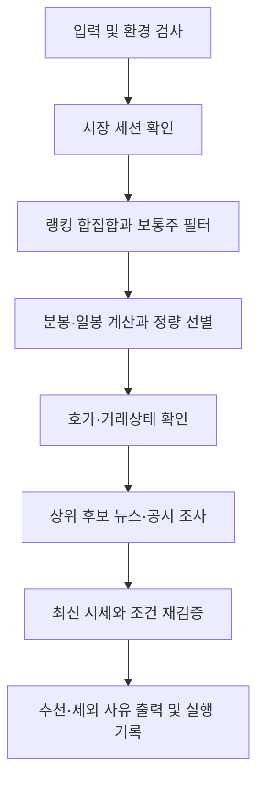

# 국내 단기매매 후보 추천 설계

작성일: 2026-09-05 · 상태: PR4-B까지 구현 및 오프라인 검증, 장중 검증 대기 · 전략 버전: `breakout-v1`

상위 문서: [설계 개요](./README.md)

## 1. 목표와 합의한 범위

개인용 CLI에서 장중 데이터를 분석해 당일매매 또는 2~5거래일 보유 후보를 최대 3개 제시한다. 사용자가 결과를 보고 거래 여부를 선택한다. 초단타·주문 실행·상시 감시는 이번 범위에 포함하지 않는다.

- `day`: 수십 분~수 시간의 당일매매. 장중 분봉 돌파를 평가한다.
- `swing`: 2~5거래일 보유. 완료된 일봉 돌파와 현재 진입 여건을 평가한다.
- 코스피·코스닥의 활성 보통주를 대상으로 한다. ETF·ETN·우선주는 제외한다.
- 최초 전략은 거래량이 동반된 돌파 하나다. 눌림목·역추세는 별도 전략으로 추후 평가한다.
- 투입 금액과 허용 손실은 미설정으로 시작한다. 후보별 가격상 손실 폭을 표시하며 수량·원화 손실액은 설정이 있을 때만 계산한다.
- 한번 실행해 결과를 출력하고 종료한다. 추천 0개도 정상 결과다.
- 기존 `analyze`의 관측값 설명은 유지하고, 추천·진입 조건은 새 `recommend`에 둔다.

이 문서의 임계값·시간 예산·전략 규칙은 초기 운영 가설이다. 검증된 수익률이나 최적 매매 조건을 뜻하지 않으며, 설정과 전략 버전을 기록해 운영 중 조정한다.

## 2. CLI 계약

아래 명령은 구현된 인터페이스다. 설치·실행은 [사용법](../../README.md#단기매매-후보-추천)을 참고한다.

```sh
tmon recommend --horizon day
tmon recommend --horizon swing
tmon recommend --horizon day --limit 3 --json
tmon recommend --horizon swing --capital 1000000 --max-loss-pct 4
tmon recommend --horizon day --research off
tmon recommend --horizon swing --config ./recommend.json
```

| 옵션 | 정의 |
| --- | --- |
| `--horizon day\|swing` | 필수. 서로 다른 전략 결과를 한 순위로 섞지 않음 |
| `--market KR` | 기본 KR. 첫 버전은 다른 시장을 입력 오류로 처리 |
| `--limit` | 1~5, 기본 3. 후보 충족 개수만 출력 |
| `--capital` | 종목당 가정 투입 원화 금액, 양수. 생략하면 null |
| `--max-loss-pct` | 진입가 대비 무효화 가격 거리의 상한, 0 초과 100 미만. 생략하면 null |
| `--research auto\|off` | 기본 auto: Codex 웹 조사. off: 정량 결과만 표시 |
| `--config PATH` | 선택적 JSON 설정 파일. 전략·데이터 시간·예산 설정 |
| `--json`, `--no-color` | 기존 공통 계약 |

설정 우선순위는 CLI > 지정 파일 > 내장 기본값이다. 숨은 전역 설정 파일은 자동 탐색하지 않는다. 알 수 없는 키·범위 오류·설정 파일 손상은 호출 전 종료 코드 2로 처리한다. 기존 관심종목 `profile`과 전략 설정을 혼용하지 않는다. 파일 선택을 저장하는 추천 전용 프로필 명령은 후속 범위다.

가격·비율·금액은 Decimal로 검증하고 계산한다. 유효 설정의 정규화된 JSON과 해시를 매 실행 기록한다.

설정 파일 v1의 주요 키와 내장 기본값은 다음과 같다. 생략 키에는 기본값을 적용한다. `model`은 `gpt-5.6-sol`, 추론 강도는 `high`로 고정한다. 이전 설정의 `model=null`도 sol로 해석하며 다른 모델 값은 설정 오류로 처리한다.

```json
{
  "configVersion": 1,
  "capital": null,
  "maxLossPct": null,
  "research": "auto",
  "model": "gpt-5.6-sol",
  "universe": {"rankCount": 50, "detailLimit": 30, "researchLimit": 5},
  "day": {"minEstimatedAvgDailyAmount": "10000000000", "maxSpreadPct": "0.30", "minVolumeRatio": "1.5", "maxBreakoutGapPct": "1.0"},
  "swing": {"minEstimatedAvgDailyAmount": "10000000000", "maxSpreadPct": "0.50", "minVolumeRatio": "1.5", "maxBreakoutGapPct": "3.0"},
  "freshness": {"rankingSeconds": 120, "quoteSeconds": 15, "minuteSeconds": 120, "stateSeconds": 30, "resultSeconds": 30, "barCompletionDelaySeconds": 5},
  "budget": {"totalSeconds": 180, "dataSeconds": 80, "researchSeconds": 70, "finalSeconds": 30}
}
```

`rankCount`는1~100, `detailLimit`는1~100, `researchLimit`는1~5이면서 detailLimit 이하다. 출력 limit은 researchLimit 이하다. 금액·임계값은 양의 십진수, 시간은 양의 정수로 검증한다. 예산은 단계별 합계가 totalSeconds 이하여야 한다. 돌파 기간·5분 집계·시간창·목표 R 배수는 v1 전략 상수로 두고 바꿀 때 전략 버전을 갱신한다.

## 3. 데이터와 현재 구현의 차이

기존 `ranking.py`, `market.py`, `analysis.py`의 랭킹·현재가·완료 일봉 및 계산을 재사용한다. 현재 `history`는 당일 일봉을 제외하므로 장중 신호에 재사용하지 않고 분봉 경로를 추가한다.

공식 토스 명세는 1분봉·일봉, 호가·체결, 종목 기본 정보·유의사항, 시장 캘린더 및 국내 지수를 제공한다. 분봉은 시작 시각을 가지며 캔들 페이지 한도는 200개다. [공식 OpenAPI 명세](https://openapi.tossinvest.com/openapi-docs/latest/openapi.json)

| 용도 | 입력/경로 | 구현 방침 |
| --- | --- | --- |
| 후보군 | `/api/v1/rankings`, `/api/v1/stocks/all` | 랭킹 합집합과 종목 유형 필터 |
| 진입 시세 | `/api/v1/prices`, `/api/v1/orderbook` | 시각·스프레드·현재 최우선 호가 확인 |
| 패턴 | `/api/v1/candles` | 1m 추가, 5m는 로컬 집계, 일봉은 기존 확정 정책 |
| 거래 여건 | `/api/v1/stocks`, `/api/v1/stocks/{symbol}/warnings`, `/api/v1/price-limits` | 정지·유의사항·VI·상하한가 검사 |
| 시장 맥락 | `/api/v1/market-calendar/KR`, 시장 지표 API | 거래 세션과 해당 상장시장 지수 비교 |
| 뉴스·공시 | Codex 웹 검색 | 날짜·출처가 있는 근거와 상충 정보 |

시장 지표의 정확한 경로·응답, 거래시장별 범위는 구현 전 현재 스키마와 실응답으로 확인한다. 표의 신규 엔드포인트는 현 클라이언트 경로 허용 목록에 GET 조회로 추가한다.

### 시간·거래시장 기준

- 추천 실행 시간은 KRX 정규장의 연속매매 구간을 기준으로 캘린더와 세션 규칙에서 계산한다. 달력 날짜·고정 시각만으로 개장을 판단하지 않는다.
- 초기 day 진입 평가 구간: 개장 30분 후부터 정규장 종료 30분 전까지. swing은 개장 30분 후부터 연속매매 종료까지다. 임시 개장 변경·단축장은 실제 세션에 상대적으로 적용한다.
- 장외·휴장은 `market-closed`, 장중 평가 시간 밖은 `outside-entry-window`로 정상 종료한다. swing도 첫 버전은 장중 신규 진입 후보만 제공한다.
- NXT 프리·애프터마켓은 첫 버전의 실행 세션에서 제외한다. 이것이 제공 시세가 KRX 전용임을 의미하지는 않는다.
- NXT 지원 여부로 종목을 제외하지 않는다. 현재가·호가·분봉·일봉·랭킹은 토스 기본 응답을 거래소 구분 없이 사용하며 직접 분리·합산하지 않는다. 결과의 `venueScope=TOSS_PROVIDED`, `venueBasis=provider-default`와 메타데이터의 `venuePolicy=TOSS_PROVIDED`는 공급자 기준 사용 정책이며 각 REST 필드의 합산 방식을 검증했다는 뜻은 아니다.
- 일봉은 토스가 반환하는 완료 일봉의 OHLCV를 그대로 사용한다. 실행 세션 뒤 시장 캘린더의 `previousBusinessDay` 연결로 day 20개·swing 65개의 공통 완료 거래일을 한 번 고정하고, 일봉과 swing 지수 자료는 이 날짜 집합을 모두 포함해야 한다. 분봉은 기존 정규장 분석 시간으로 제한한다. 시간 필터가 KRX 거래만 추출하는 것은 아니다. 거래량 배수는 동일한 토스 봉 종류끼리 비교하며, 과거 집계 기준·NXT 편입 변경에 따른 연속성은 운영 관측 항목이다.
- KRX 거래정지, 정리매매 또는 지원되는 NXT의 명시적 거래정지는 후보 제외 사유다. NXT 거래정지 값은 nullable로 처리하며, null만으로 제외하지 않는다. VI·종목 경고는 KRX·NXT·거래소 미지정 모두 기존 경고 제외 규칙을 적용하고 최종 단계에서 재확인한다.
- 분봉은 상세평가 대상 확정 뒤 고정한 실제 스크리닝 단계 시작 시각 `phaseStartedAt`으로 완료를 판단한다. `S`를 정규장 시작, `P`를 단계 시작, `D`를 분봉 완료 지연으로 두면 `n=floor((P-S-D)/300)`, `F=S+n×300`이 고정 신호 구간 종료(`signalWindowEndAt`)다. 완료 인정은 `barEnd+D<=phaseStartedAt`, 구간 절단은 `barEnd<=F`이며 이미 지연을 반영한 `F`에 지연을 중복 차감하지 않는다. 응답 수신 시각 `receivedAt`은 미래 봉·다음 분 경계 판단에만 쓰고, 원천 최신성은 고정 구간 절단 전 최신 사용 가능 봉을 실제 수신 시각으로 검사한다. 고정 305초 검사는 사용하지 않는다. `n<=0`이면 완료 5분봉이 없고, `n<6`이면 예상된 평가 불가(`session-not-ready`)로 처리하며 이전 봉으로 대체하지 않는다. 필수 최신 `F` 봉이 없으면 대체 없이 제외한다.
- 평가 시각의 다음 분 경계에 해당하는 미래 봉은 경고와 함께 제외한다. 다음 분 경계를 넘는 미래 봉은 `future-minute-bar` 오류로 처리한다. 미래 판단은 실제 응답 수신 시각(`receivedAt`) 기준이며, 시각 의미를 바꾸지 않고 완료·연속성·신선도 검증을 유지한다.
- 5분봉은 세션 개장 기준으로 정렬된 연속 1분봉 5개로만 만든다. 무거래와 수집 누락을 구분할 수 없으면 임의의 0거래량 봉을 만들지 않는다.
- PR2 상대수익률의 지수 기준은 통화·수정 옵션이 없는 공급자 지수 포인트(`provider-index-points`)이고, 종목 일봉·분봉은 `adjusted=true` 응답(`adjusted`)을 사용한다. `priceBasis`와 수익률 계산법(`returnCalculation`)을 섞지 않는다. PR4-B 최종 검증은 같은 사용 창의 `adjusted=false` 가격·거래량을 함께 대조하며, 가격이 다르고 거래량만 같은 경우도 `adjustment-basis-unverified`로 제외한다. 일치 판정은 관찰한 창의 일관성만 의미하며 공급자의 기업행사 전역 보증이 아니다.
- 당일 누적 거래량과 전일 하루 거래량을 동일 시간 기준인 것처럼 비교하지 않는다. 첫 버전의 day 거래량 배수는 당일 직전 구간 비교다.

### 데이터 신선도 초기 기준

| 입력 | 허용 조건 |
| --- | --- |
| 랭킹 | `rankedAt`이 조회 시각보다 120초 이내 과거 |
| 현재가·호가 | 데이터 시각이 각 조회 시각보다 15초 이내 과거 |
| 1분봉 | 마지막 완료 봉 종료 시각이 평가 시각보다 120초 이내 과거 |
| 일봉 | 캘린더상 직전 완료 거래일까지 포함 |
| 종목 경고·거래정지 | 최초 확인 후 최종 후보에서 재조회, 최종 조회 경과 30초 이내 |
| 최종 결과 | 최종 재검증 완료 후 최대 30초, day/swing 동일 |

미래 시각은 초기 시계 오차 허용 5초를 초과하면 오류다. 조회 시각만 있고 원천 시각이 없는 시세는 최신으로 간주하지 않는다. 유의사항처럼 원천 시각이 없는 상태 응답은 조회 시각과 공급자의 갱신 특성을 따로 표시한다.

`expiresAt`은 최종 생성 시각+30초, 시세·호가 각 데이터 시각+15초, 현재 진입 세션 종료 중 가장 이른 시각이다. 완료 전 이미 만료되면 1회 재조회하고 그래도 실패하면 제외한다. 실제 유효 기간이 30초보다 짧을 수 있다.

## 4. 실행 흐름과 후보군



- day: 시장 전체 `amount/volume/gain`, 기간 `1d`, 각각 상위 50개.
- swing: 시장 전체 `amount 1d / gain 1w`, 각각 상위 50개.
- 각 요청에 투자 유의종목 제외를 적용하고 합집합을 심볼로 중복 제거한다. 상승률에 `realtime`을 요청하지 않는다.
- 사전 정렬은 랭킹별 `1/(60+rank)`의 합 내림차순, 동률은 심볼 오름차순. 순서대로 기본정보를 확인하고 보통주·거래 상태·상장 초기 이력 요건을 통과한 최대 30개를 상세 분석한다. 사전 제외는 `eligibility` 단계로 기록하며 상세평가 한도를 소모하지 않는다. 랭킹 후보군과 데이터 단계 시간 예산 안에서만 다음 후보를 확인한다.
- 세션 확인 직후 day 20개 또는 swing 65개의 완료 `previousBusinessDay` 연결을 한 번 고정한다. day는 19회, swing은 64회 추가 달력 링크가 필요할 수 있으며 이 기준은 후보마다 다시 조회하지 않는다. 날짜·요청 echo·세션 완료·`nextBusinessDay` 연결이 맞지 않으면 `tradingDateReference`를 미확인으로 기록하고 평일 추정으로 대체하지 않는다.
- 일봉 응답은 고정한 공통 날짜 집합과 정확히 대조한다. 중간 날짜 결측·중복·예상 밖 날짜는 `daily-gap`으로 기록하며 봉을 채우지 않는다. 기준 창에서 상장일 이후 가능한 거래일이 요건보다 적으면 `listing-history-too-short`에 실제 날짜 근거를 붙여 예상 제외한다.
- 모든 원본 후보·각 공급자 순위·상세 분석 여부·제외 사유를 기록한다. 결과를 전 종목 스크리닝이라고 부르지 않는다.
- 특정 후보의 데이터 오류는 그 종목을 제외한다. 세션·후보군 랭킹 전체 실패는 실행 오류다. 일부 랭킹 실패는 범위 축소를 표시하고 부분 결과로 진행한다.
- 정량 통과 종목 중 상위 최대 5개만 웹 조사·최종 재검증한다. 최종 탈락으로 3개 미만이 되어도 재귀적으로 후보를 계속 보충하지 않는다.
- 조사 뒤 원래 shortlist 최대 5개에 대해서만 비수정(`adjusted=false`) day 20개·swing 65개를 조회해 수정주가 신호 창과 날짜·시각·OHLC·거래량을 대조한다. 가격이 다르고 거래량만 같아도 단위 보장을 입증하지 못하므로 `adjustment-basis-unverified`로 제외한다. 관찰상 동일해도 공급자 전역 기업행사 보증이 아니라 해당 창의 일관성만 기록한다. 비수정 최근 20개 종가×거래량 평균이 낮으면 `low-liquidity`이며, 검증 실패에도 계산 가능한 평균을 남긴다.

기본 제외 조건은 거래정지, 정리매매, 단기과열, 투자경고·위험, 활성 VI, 비정상/오래된 호가, 필수 데이터 부족이다. VI는 거래시장별 상태로 검사한다. 이 조건은 초기 전략이 평가하려는 거래 상황을 한정하기 위한 것이다.

## 5. 정량 전략과 순위

최초 구현은 가중 점수 대신 명시적 통과 조건과 정렬 기준을 사용한다. 확률·승률·AI 신뢰도 점수는 만들지 않는다. 표의 기준은 설정 파일에서 바꿀 수 있다.

| 설정 | day | swing |
| --- | --- | --- |
| 최소 최근 20 완료 일봉 평균 거래대금 | 100억 원 추정값 | 100억 원 추정값 |
| 최대 호가 스프레드 | 0.30% | 0.50% |
| 돌파 거래량 배수 | 1.5 이상 | 1.5 이상 |
| 돌파 후 최대 가격 괴리 | 돌파선 대비 1.0% | 돌파선 대비 3.0% |
| 필수 일봉 수 | 20개 | 65개 |

평균 일거래대금은 `mean(일봉 close × volume, 20봉)`의 **추정값**이다. 필드명은 `estimatedAvgDailyAmount`이며 실제 거래대금으로 표기하지 않는다. 캔들에는 정확한 기간 거래대금이 없으므로 정확한 VWAP도 제공하지 않는다. 스프레드는 `(bestAsk-bestBid)/((bestAsk+bestBid)/2) × 100`이다.

### day: 최근 5분봉의 거래량 동반 돌파

1. 후보당 당일 완료 1분봉을 최근 최대 120개 확보해 연속 5분봉을 구성한다. 최소 6개 완료 5분봉이 필요하다.
2. 최근 완료 5분봉 `b` 직전 5개 봉의 고가 최댓값을 돌파선 `B`로 정한다. 비교 창에 `b`는 포함하지 않는다.
3. `close(b) > B`, `volume(b) / mean(volume(직전 5봉)) >= 1.5`를 동시에 충족해야 한다. 직전 봉 종가가 B 이하이고 최신 봉 종가가 B 위인 전이를 확인한다.
4. 가정 진입가는 최신 `bestAsk=E`. `B < E <= B × 1.01`이고, `E`가 해당 거래시장의 상한가보다 낮아야 한다.
5. 무효화 가격 `S = min(low(b), low(직전 5분봉))`. `0 < S < B < E`가 아니면 제외한다.
6. 최근 완료 30분의 종목 수익률에서 같은 시각·같은 거래시장 범위의 상장시장 지수 수익률을 뺀 `relativeReturn30mPct`를 계산한다. 비교 범위가 안 맞거나 데이터가 없으면 null로 표시한다.
7. 정렬: 비교 가능한 상대수익률 보유 여부 → 상대수익률 내림차순 → 돌파 거래량 배수 내림차순 → 스프레드 오름차순 → 심볼 오름차순. 상대수익률은 필수 통과 조건이 아니다.

장중 돌파가 이미 많이 진행된 종목을 새 진입 후보로 올리지 않는다. latest completed 5분봉이 바뀌면 새 봉으로 전 조건을 다시 평가한다.

### swing: 직전 완료 일봉의 20일 고가 돌파

1. 공통 캘린더가 확인한 정확한 65개 거래일의 완료 수정주가 일봉을 확보한다. 더 긴 응답을 받아도 신호에는 마지막 65개만 사용한다.
2. 최신 완료 일봉 `d` 이전 20개 일봉의 고가 최댓값을 `B`로 정한다. `close(d) > B` 및 `volume(d)/mean(volume(직전 20일)) >= 1.5`를 요구한다.
3. `close(d) > SMA20 > SMA60`, `SMA20(d) > SMA20(d-5거래일)`을 동시에 요구한다. SMA20(d-5)는 해당 시점에서 끝나는 20개 종가로 계산한다.
4. 현재 가정 진입가 E가 `B < E <= B × 1.03`을 충족해야 한다. 당일 미완료 일봉은 돌파 확정에 사용하지 않는다.
5. `S = min(low(d), low(d-1))`. `0 < S < B < E`가 아니면 제외한다.
6. 종목과 해당 시장 지수의 동일한 완료 5거래일 수익률 차이를 보조 지표로 계산한다. 비교 불가능하면 null이다.
7. 정렬: 비교 가능한 상대수익률 보유 여부 → 5거래일 상대수익률 내림차순 → 돌파 거래량 배수 내림차순 → 스프레드 오름차순 → 심볼 오름차순.

최근 여러 날의 돌파를 소급해 잡는 옵션은 v1에 넣지 않는다. 같은 종목이 두 horizon에 들어와도 결과·보유 가정·순위는 분리한다.

### 진입·목표·보유 기간 표시

- `entryReference=E`, `entryRange=(B, B×(1+괴리상한)]`, `invalidation=S`, `riskPerShare=R=E-S`.
- `riskPct=(E-S)/E×100`. `--max-loss-pct`가 있으면 이 값을 초과하는 후보를 제외한다. 이는 가격상 거리이며 갭·체결 비용을 포함한 최대 실제 손실 보장이 아니다.
- 목표 구간 `[E+1.5R, E+2R]`, `targetBasis=risk-multiple`로 표시한다. 관측된 저항선이나 예상 미래 가격으로 부르지 않는다. day에서 해당 시장 상한가가 1.5R보다 낮으면 제외하고, 구간 상단만 넘으면 상한가로 제한해 실제 배수를 다시 표시한다. swing에는 당일 상한가를 미래 목표 제한으로 적용하지 않는다.
- day의 시간상 종료 기준은 현재 정규장 종료 10분 전이다. swing은 진입일을 1일차로 센 2거래일차 점검, 5거래일차 정규장 종료 전까지 보유하는 가정이다. 목표·무효화 조건은 그 이전에도 적용된다.
- 미래 거래일 캘린더가 없으면 정확한 종료 날짜는 null, `holdingSessions=2..5`와 미확인 사유를 출력한다.
- capital이 있으면 `quantity=floor(capital/E)`, `estimatedPriceRiskKrw=quantity×R`를 계산한다. 0주이면 제외한다. 수수료 등은 별도 항목이다.
- 자본 설정 시 최우선 매도 잔량으로 가정 수량을 충족하지 못하면 `insufficient-visible-depth`로 제외하는 보수적 v1 규칙을 적용한다. 자본 미설정이면 `sizeCheck=not-configured`다. 호가 잔량은 체결 보장이 아니다.

## 6. Codex SDK와 웹 조사

공식 Python SDK `openai-codex`를 별도 어댑터에서 사용한다. Python 3.10 이상과 SDK에 포함된 로컬 런타임이 필요하다. 구현 시 프로젝트 최소 Python을 3.10으로 올리고 SDK는 선택적 `ai` 의존성으로 추가한다. 기본 조회 명령은 SDK를 import하지 않는다. [공식 SDK 문서](https://learn.chatgpt.com/docs/codex-sdk)

웹 검색은 live 모드를 명시한다. SDK별 설정 전달 방식은 설치 버전을 고정한 뒤 확인하고, 글로벌 Codex 설정 파일을 수정하지 않는다. [공식 웹 검색 문서](https://learn.chatgpt.com/docs/web-search)

Codex는 ChatGPT 로그인 또는 API 키 인증을 지원한다. 구현 전 실제 SDK 런타임의 로그인 상태와 지원되는 인증 경로를 확인한다. 앱에 로그인되어 있다는 이유만으로 SDK 인증이 된 것으로 간주하거나 새 API 키 생성을 전제하지 않는다. 이 설계 작업에서는 인증·키·사용량을 변경하지 않는다. [공식 인증 문서](https://learn.chatgpt.com/docs/auth)

### 역할 분담

- Python: 데이터 수집, 필터, 가격·목표·손실 계산, 정렬, 재검증, 기록, 출력.
- Codex: 후보 이름·심볼·거래소·조회 기준일과 정량 요약을 받아 최근 재료·상충 근거·예정 일정을 조사하고 한국어로 설명.
- SDK 입력에는 후보 최대 5개와 공개 시장 데이터만 제공한다. 토스 인증 환경 변수와 토큰 캐시는 SDK 프로세스에 전달하지 않는다. 자본·손실 설정도 뉴스 조사에 불필요하므로 전달하지 않는다.
- 검색 결과를 지시문으로 실행하지 않는다. SDK 실행 환경은 조사에 필요한 최소 파일 접근으로 구성한다. 수치나 선정 규칙을 모델이 수정하도록 맡기지 않는다.
- 종목별 조사 결과를 구조화된 객체로 받는다. 어댑터가 후보 외 심볼·가격 재정의·유효하지 않은 필드·출처 없는 사실을 거부한다. 구체적인 구조화 출력 API는 고정 SDK 버전에서 검증한다.
- 공식 공시·기업 IR을 우선하고, 언론 보도는 매체와 게시 시각을 표시한다. 과거 기사 재노출을 새 사건으로 취급하지 않는다.

### 조사 출력 계약

종목별 `researchStatus=verified|no-relevant-source|unavailable`, `summary`, `catalysts[]`, `counterEvidence[]`, `upcomingEvents[]`, `sources[]`를 받는다. 각 사실은 `sourceIds`, `publishedAt`, `eventAt`, `retrievedAt`을 가지며 미제공 날짜는 null이다. 검색 결과 없음은 호재·악재 없음이 아니다.

- day: 최근 72시간의 사건을 우선 조사하고 오래된 배경은 구분한다.
- swing: 최근 14일 사건과 다음 5거래일 내 기업 일정을 우선 조사한다.
- 기사의 게시 시각과 사건 시각을 분리한다. 기준 시각 이후의 게시물은 해당 실행 근거에 포함하지 않는다.
- 검색 접근 실패·시간 초과·구조 오류이면 정량 후보를 보존하고 `researchStatus=unavailable`을 표시한다.
- v1에서는 웹 해석이 정량 순위를 바꾸거나 후보를 자동 탈락시키지 않는다. 확인된 악재와 예정 실적 발표 등은 결과의 눈에 띄는 위치에 제시한다. 거래정지 등 구조화 API에서 재확인한 사항만 필수 제외 조건에 반영한다.
- 뉴스 요약 캐시는 day 15분, swing 60분. 키는 심볼·horizon·조사 범위·프롬프트 버전·모델이다. 캐시 사용과 검색 시각을 표시한다. 시세는 캐시된 뉴스와 별도로 항상 재검증한다.

모델은 설정 가능하게 하고 특정 최신 모델명을 문서에 고정하지 않는다. 실제 사용 모델·SDK 버전·프롬프트 버전을 기록한다. 최종 재검증으로 선정 근거가 바뀌면 이전 수치에 의존한 설명은 폐기하고, 시각이 유효한 뉴스 사실만 유지한다.

## 7. 실행 시간과 실패 처리

현재 transport의 60초 제한은 기존 명령에서 유지한다. recommend는 상위 실행기가 전체 deadline을 소유하고 남은 예산을 데이터 클라이언트와 SDK에 전달한다.

초기 예산은 전체 180초: 데이터 수집·선별 최대 80초, 조사 최대 70초, 최종 재검증·저장·출력 30초를 예약한다. 앞 단계가 남긴 시간은 다음 단계가 쓰되 재검증 예약은 소모하지 않는다. 웹 조사는 한 스레드에서 후보를 묶어 처리하고 구조 오류 복구는 조사 예산 안에서 최대 1회다.

API 그룹별 응답 한도를 반영해 초기에는 순차 호출한다. 시간 부족으로 분석하지 못한 종목은 불합격으로 기록하지 않고 `not-evaluated-budget`으로 남긴다. 충분한 후보가 이미 있으면 부분 결과를 출력한다. 초기 제한은 장중 실행의 p50/p95 소요 시간을 측정해 조정한다.

최종 5개 후보는 원 신호를 다시 계산하지 않고 현재가·호가·상한가·경고·거래 상태·세션으로 진입 조건과 수량을 재검증한다. 조사 뒤에는 비수정 day 20개·swing 65개를 추가로 조회해 조정 기준을 확인한 다음 최종 호가를 읽는다. 신호용 분봉은 최종 단계에서 다시 조회하지 않는다. 이전에 통과했다는 이유로 만료 후보를 유지하지 않으며, 시간이 없으면 검증되지 않은 종목을 출력에서 제외한다. 중단 시 SDK 자식 프로세스도 종료한다.

| 상황 | status / 종료 코드 | 결과 |
| --- | --- | --- |
| 정상, 조건 충족 0개 포함 | ok / 0 | 추천 또는 `no-match` |
| 휴장·장외·평가 시간 밖 | ok / 0 | 빈 추천과 reason, SDK 미호출 |
| research off | ok / 0 | `researchStatus=disabled` |
| auto에서 SDK 미설치·인증 미확인·조사 실패 | partial / 0 | 정량 결과와 구체적인 조사 불가 사유 |
| 일부 입력 누락·분석 예산 초과 | partial / 5 | 검증 완료 후보와 미평가 범위 |
| 전 후보의 필수 데이터가 불충분 | error / 5 | 추천 없음, `insufficient-data` |
| 입력·설정 오류 | error / 2 | 네트워크 미호출 |
| 토스 인증 오류 | error / 3 | 추천 없음 |
| 필수 시장·후보군 조회 전체 실패 | error / 4 | 추천 없음 |
| 예상치 못한 오류 / 사용자 중단 | error / 1 또는 130 | 기존 규칙 |

여러 장애가 겹치면 필수 데이터 실패가 조사 실패보다 우선한다. `no-match`는 충분한 데이터로 조건을 평가한 결과일 때만 사용한다. 후보군 일부가 미평가이면 0개여도 partial이다.

## 8. 출력과 실행 기록

기존 `schemaVersion=1`, `command`, `status`, `data`, `meta`, `warnings`, `error` envelope을 사용한다. 추가로 `meta.recommendSchemaVersion=1`을 기록한다.

`data`는 추천 배열이다. 항목은 다음 필드를 가진다.

- 식별: `rank`, `symbol`, `name`, `market`, `horizon`, `strategyVersion`.
- 관측: `lastPrice`, `bestBid`, `bestAsk`, `spreadPct`, `signalAsOf`, `quoteAsOf`, `orderbookAsOf`, `venueScope`.
- 계산: `breakoutLevel`, `volumeRatio`, 상대수익률, 추정 평균 거래대금, 필요한 지표·각 계산 기준.
- 매매 가정: `entryReference`, `entryRange`, `invalidation`, `riskPct`, `targetRange`, `targetBasis`, `holdingSessions`, `reviewDate`, `exitBy`, `quantity`, `estimatedPriceRiskKrw`, `sizeCheck`.
- 근거: `quantitativeReasons[]`, `research`, `limitations[]`, `expiresAt`.

`meta`에는 `runId`, 시작·종료 시각, 유효 설정·해시, 소스별 시각, 거래 세션, 전략·모델·프롬프트 버전, 스캔/통과/미평가 개수, 후보군 구성, 제외 사유별 개수, 단계별 소요 시간, `outcomeReason`, `recordPath`를 둔다. `tradingDateReference`는 공통 day 20개·swing 65개 날짜와 조회 출처·미확인 사유를, `dailyChecks`는 종목별 날짜 대조를, `adjustmentChecks`는 비수정 raw 대조·비수정 거래대금과 기준을 보존한다. 금액·가격·비율은 십진 문자열, null은 사유와 함께 제공한다.

기본 터미널 출력 순서는 실행 시각·horizon·스캔 범위 → 후보 비교표 → 종목별 선정 근거/진입 조건/무효화/목표/뉴스/불리한 점 → 제외 요약이다. 수치가 없는 가짜 예시 종목을 실제 결과에 섞지 않는다. JSON 모드는 stdout 객체 하나, 진행 상태는 stderr다.

### 로컬 저장

- macOS: `~/Library/Application Support/tmon/recommend/runs/<runId>/`.
- Linux: `$XDG_DATA_HOME/tmon/recommend/runs/<runId>/`, 미설정 시 `~/.local/share/tmon/recommend/runs/<runId>/`.
- 파일: `result.json`, `inputs.json`(실제 사용 시장 데이터·전체 후보군·제외/미평가 사유), `research.json`(출처 메타데이터·짧은 요약). 기사 전문과 인증값은 저장하지 않는다.
- 기존 관심종목 파일과 별개이며 실행 단위 디렉터리를 원자적으로 완성한다. 사용자 전용 디렉터리·파일 권한을 사용한다.
- 저장 실패 시 화면 결과는 보존하고 `partial / 0`, `recordPath=null`, `record-write-failed`를 표시한다. 다른 오류가 있으면 해당 종료 코드가 우선한다.
- 초기에는 자동 삭제하지 않는다. 보존 기간·정리 명령은 실제 용량을 확인한 후 추가한다. 캐시와 실행 기록의 목적·수명은 분리한다.

## 9. 모듈 경계와 구현 순서

| 모듈 후보 | 역할 |
| --- | --- |
| `recommend.py` | 실행 흐름·예산·재검증·결과 조립 |
| `intraday.py` | 분봉 정규화·완료 판단·5분 집계 |
| `strategies.py` | day/swing 순수 계산·필터·정렬 |
| `research.py` | Codex SDK 선택적 로딩·웹 조사·스키마 검증 |
| `recommend_config.py` | 설정 검증·기본값·해시 |
| `recommend_store.py` | 원자적 실행 기록·뉴스 캐시 |
| 기존 client/market/cli | 신규 조회 경로·응답 정규화·명령 등록 |

1. **데이터 확인:** 장중 표본으로 거래시장 범위·분봉 확정 지연·호가 시각·시장 상태·호출 예산 확인. 스키마와 실응답이 어긋나면 차이를 문서화하고 영향을 받는 조건부터 수정.
2. **정량 커맨드:** 설정·세션·후보군·분봉·day/swing·JSON·기록 구현. `--research off`로 독립 실행.
3. **Codex 조사:** 인증 경로·SDK 버전 고정, live 검색·근거 스키마·시간 초과 처리 연결.
4. **운영 관측:** 실제 장중 수행 시간, 후보 수, 제외 사유, 데이터 오류, 검색 가치를 기록. 이 단계까지가 첫 사용 가능 버전.
5. **성과 비교:** 저장 기록과 후속 가격을 연결하는 별도 `evaluate` 설계를 작성. 이번 recommend 구현에 자동 매매나 평가 엔진을 숨겨 넣지 않는다.

## 10. 검증과 완료 기준

필수 테스트는 결과를 바꿀 수 있는 경계와 계산에 집중한다.

- 손계산 가능한 고정 OHLCV로 돌파선·거래량 배수·SMA·정렬·진입/무효화/목표 검산.
- 5분 경계·미완성 분봉·봉 누락·무거래·중복·0분모·조정주가 불일치 확인.
- 휴장·단축장·NXT 세션·장 종료 도중 실행을 구분. NXT 지원 종목의 day/swing 추천과 KRX·NXT 경고 재검증을 확인.
- SDK 응답을 기다리는 사이 가격 이탈, 새 5분봉, VI, 오래된 호가가 생기면 재검증에서 제외.
- 필수 데이터 미확인과 조건 불충족, 부분 랭킹 실패, 예산 미평가를 각각 구분.
- 검색 실패·출처 누락·시각 미상·다른 종목·수치 변경·명령이 섞인 웹 텍스트에 대해 조사 결과만 제한하고 정량 계약 유지.
- capital 미설정/0주/호가잔량 부족, 손실 상한 경계, JSON 십진 문자열과 종료 코드 확인.
- 저장 실패·중단·SDK 미설치 환경 및 기존 CLI 회귀 확인.

실 API 검증은 장중 데이터 확인 단계에서 별도로 수행한다. 설계 문서 열람만으로 데이터 지연·체결 가능성·전략 수익성이 검증됐다고 기록하지 않는다.

성과 평가에서는 추천 이후 가능한 진입을 먼저 정의해야 한다. 추천 이전 봉의 고가·저가로 유리한 체결을 가정하지 않는다. 추천 미체결, 목표/무효화 동시 도달 봉의 순서 불명확, 보유 중 휴장·거래정지·기업행사를 구분한다. 수수료·세금·호가 차이·슬리피지 가정은 날짜와 함께 저장한다. 미래 가격만 비교한 수익률은 전략 실현 성과와 구분한다.

같은 날 여러 추천을 독립 거래처럼 합산하지 않는다. 실제 당시 후보군과 설정 버전을 보존하며, 운영 중 설정 조정에 쓴 기간과 이후 평가 기간을 나눠 비교한다. 이 검증을 기다리느라 개인용 정량 후보 기능의 사용을 막지는 않는다.

## 11. 구현 전 확인 항목

새 사용자 결정이 없어도 설계를 진행할 수 있다. 다음은 구현·장중 표본 확인에서 해결할 기술 항목이다.

- 토스 봉·호가·현재가의 집계 범위와 과거 연속성, 지수와의 비교 기준을 운영 중 확인. 거래시장 범위 미확인만으로 종목을 제외하지 않는다.
- 분봉 확정 지연과 시세 갱신 주기에 맞는 5초/15초/120초 초기 신선도 기준.
- SDK 실제 설치 버전의 config 전달·구조화 출력·취소·자격 증명 재사용·사용량 메타데이터.
- SDK가 조사만 수행하도록 제한하는 런타임 기능과 필수 환경 변수 목록.
- 신규 지수·시장 캘린더 응답에서 세션 및 향후 5거래일을 확정할 수 있는 범위.

확인 결과로 바뀌는 필드나 규칙은 이 문서와 전략 버전에 반영한다.

## 12. 첫 구현에서 확인한 사항과 적용 차이
- 공식 스키마 1.2.14를 내려받고 실제 휴장일 캘린더를 확인했다. `singlePriceAuctionStartTime`을 연속매매 종료 기준으로 사용한다. 별도 KRX 시작 시각은 제공되지 않아 정규장 합집합의 시작과 KRX 종가단일가 시각을 사용한다. 해당 필드가 없으면 세션 미확인이다.
- 2026-09-05 사용자 결정에 따라 NXT 지원 종목을 포함하고 토스 제공 시세를 거래소 구분 없이 사용한다. NXT 지원 여부는 결과의 `nxtSupported` 메타데이터로 보존한다. REST 집계 범위 미확인에 따른 종목 제외 조건은 제거했다. 과거 NXT 편입 변경·기업행사 시계열은 장중 확인 항목으로 남는다.
- 상세 평가 30개 제한은 랭킹 합집합 전체를 최대 200개 심볼 단위로 사전 조회한 뒤, 보통주·ACTIVE·KRW·거래 상태와 상장 초기 이력을 통과한 순서에만 적용한다. 사전 조건 제외와 데이터 미확인은 각각 `preExcluded`의 condition/data로 기록하며, 통과한 행만 상세 평가 예산을 사용한다. 후보군과 데이터 단계 시간 예산은 유지하고 최초 버전은 전 종목 탐색으로 확대하지 않는다.
- SDK 0.147.0을 선택적 의존성으로 고정했다. 포함 런타임에서 기존 ChatGPT 로그인을 확인하며 API 키 계정이면 조사를 실행하지 않는다. 웹 조사 모델은 `gpt-5.6-sol`, 추론 강도는 `high`로 고정한다.
- SDK는 별도 Python 프로세스에서 허용된 환경 변수만 전달받는다. 빈 임시 작업 폴더, read-only sandbox, 승인 요청 거부, shell 도구 비활성화 및 live 검색 설정을 사용한다. 조사 timeout/사용자 중단은 SDK 런타임을 포함한 프로세스 그룹을 종료한다.
- 구조화 출력 실패는 자동 재시도 없이 정량 결과로 복귀한다. 검색 이벤트가 한 번도 없으면 웹 조사 성공으로 취급하지 않는다. 캐시 키에는 모델과 추론 강도를 포함한다. 이전 low 강도 조사 캐시는 재사용하지 않는다.
- 시장 상대수익률은 선택적 조회이며 미확인 시 null과 한계를 표시한다. day는 같은 30개 분봉 구간의 첫 시가~마지막 종가, swing은 같은 날짜의 5거래일 종가 변화를 비교한다. 이는 토스 종목 시세와 상장시장 지수의 비교이며 동일 거래소·동일 종가 시각의 수익률을 보장하지 않는다.
- 실행 기록의 result는 화면 JSON과 동일한 십진 정밀도로 저장하고 inputs에는 계산 전 원본을 보존한다. 미래 거래일은 캘린더의 nextBusinessDay를 따라 조회하며 실패하면 종료 날짜를 null로 둔다.
- 조건 미충족과 데이터 오류, 웹 조사 중 가격 이탈·VI 발생을 구분하는 테스트를 추가했다. 오늘은 휴장일이므로 실제 장중 지연·추천 후보·분봉 확정 규칙의 실환경 검증은 아직 남아 있다.

## 13. snapshot-v2 PR0~PR4-B 구현 상태 (2026-09-08)

작업 명세([snapshot-v2 작업 명세](./recommend-snapshot-v2-work-spec.md))와 인터페이스 결정([snapshot-v2 인터페이스](./recommend-snapshot-v2-interfaces.md))의 PR0~PR4-B가 구현되었다. 기존 `stock_eligibility`의 상장 초기 판정과 사전 필터(랭킹 순서대로 적격 후보에 상세평가 한도 사용) 동작은 보존한다.

- `inputs['screened']`: 조사 전 정량 통과 행 전체의 깊은 복사 스냅샷으로, 각 통과 직후 즉시 추가하므로 이후 후보의 인증 실패·중단 시에도 앞선 통과분이 보존되고 `quantitativePassCount`는 보존된 행에서 복원된다. 행마다 `signalId`/`signalInputHash`(정규화 입력 SHA-256), 돌파선·무효화 가격·거래량 배수, `relativeReturnWindow`, 최초 진입가·위험폭·목표·수량을 보존하며 조사 변형·최종 가격 변경과 분리한다.
- 종목 정보 재사용: 스크리닝 `current_data()`는 최대 200개 심볼의 사전 조회 `/api/v1/stocks` 응답을 배치별로 재사용해 후보당 상세 호출 2회→1회, STOCK 그룹 3회→2회를 달성한다. 랭킹 합집합 전체를 먼저 보통주·ACTIVE·KRW·거래 제한으로 사전 확인한 뒤 통과 순서에만 `detailLimit`을 적용한다. 최종 검증은 종목 정보·경고를 항상 새로 조회한다. `requestPhaseCounts`가 prefetch/screening/final을 구분하고 `endpointCounts`·`endpointGroupCounts`가 논리 호출(호환 유지)을, `actualAttemptsByEndpoint`·`actualAttemptsByGroup`이 호출별 중첩 원장에 persisted된 실제 전송 시도(인증 포함)를 집계한다.
- 관측: `RecordingClient`와 `Transport`가 성공·실패 모두에 `requestStartedAt`·`receivedAt`(기존 `retrievedAt` 유지)·`endpointGroup`·`attemptCount`·`rateLimitWaitSeconds`·`retryWaitSeconds`·`elapsedSeconds`·성공 여부·안전한 오류 코드를 기록한다. 대기 시간은 계획값이 아니라 실제 일시정지 측정값이며 거부·중단 시 0초로 기록된다. 인증 호출 관측은 대상 조회에 합산되지 않고, 오류 코드는 안전 패턴으로 정규화된다. 예산·경과에는 주입 단조 시계, 관측 시각에는 aware 실제 시각을 사용한다. 비밀·인증 헤더·요청 본문·원문 오류 메시지는 저장하지 않는다.
- 오류 분류: `listing-history-too-short`(상장일·요건·상한 증거 포함)만 예상 제외이며, `insufficient-history`·`stale-daily`·`incomplete-bars`·`zero-volume-baseline`은 증거 없이 데이터 미확인으로 남는다. 기존 `ok/partial/error`·종료 코드는 유지하고 `executionStatus`(completed/failed)·`coverageStatus`(complete/partial/not-evaluated)·`expectedIneligibleCount`·`candidateDataUnavailableCount`(중복 제외 사건이 아닌 고유 후보 심볼 수; `excludedCounts`는 사건 수 유지)를 추가한다. 부분 랭킹 실패는 정량 커버리지 `partial`로 추적하고, 웹 조사만의 실패는 정량 커버리지를 오염시키지 않는다. 근거 있는 단일 단기상장 제외는 `ok`/0이 가능하고, 설명되지 않은 전체 미확인은 정상 후보 부재로 표시하지 않는다.
- 회귀: `tests/test_recommend_pr0.py` 30개가 screened 범위·즉시 보존(인증 실패·중단 시 디스크 포함)·불변성, 상세 호출 중복 제거 수, 성공/실패/재시도/실제 대기 관측, 인증 분리·0 시도 보존, 전송 원장의 `inputs.json` 지속(`transportRequests` 중첩·실제 시도 집계), 중단 시 안전 기록, 안전 코드 정규화, 예상/미확인 분류, 고유 심볼 계수를 검증한다.

PR1(실제 시각·완료 봉 정합성)은 상세평가 대상 확정 뒤 실제 `phaseStartedAt` 하나를 고정하고 `signalWindowEndAt`(`F=S+n×300`)로 스크리닝 전체를 평가한다. 분봉 완료·미래·연속성 검사는 스크리닝에만 적용하며, 최종 단계는 저장된 신호 snapshot과 새 종목 상태·현재가·호가·가격제한을 대조한다. `completed_minutes()`의 brief 기본 동작은 유지하고 추천 전용 실제 수신·단계 시작·고정 구간 인수를 지원한다. `session-not-ready`는 조건(예상된 평가 불가)으로 집계하며 데이터 미확인에 넣지 않는다. 회귀는 `tests/test_recommend_pr1.py` 10개가 공식·`n<=0`·`n<6`, 10:00:10(`D=5`)의 09:59 포함, `D=1·5·60` 경계 전·정각·후, 수신 시각 분 경계 spanning, 필수 최신 누락 대체 금지, 절단 전 최신성, 진행 가짜 시계 통합을 검증한다.

PR2(상대수익률 고정 구간·지수 캐시)는 `day`의 `signalWindowEndAt` 직전 30개 연속 완료 1분봉(`[F-30분, F)`)과 `swing`의 공통 거래일 창을 종목·지수에 적용한다. 지수는 통화가 없는 `MarketIndicatorCandle` 응답을 정규화하며, 각 시장의 성공 또는 미확인 결과는 비교 양 끝점·기준·완료 정책·기대 거래일을 포함한 키로 고정한다. 필요한 구간을 확보하지 못하면 최대 1회 재시도한다. `index-fetch-failed`·`index-bar-missing`·`index-data-invalid`·`stock-bars-noncontiguous`·`comparison-basis-unverified`는 `relativeReturnReason`으로 구분하며 미확인 값을 필수 탈락이나 양수 조건으로 바꾸지 않는다. 최종 단계는 저장된 상대수익률과 비교 구간을 유지하며 현재 지수를 다시 조회하지 않는다. 회귀는 `tests/test_recommend_pr2.py`가 지수 스키마·공통 시간 필터·고정 창·캐시 정합성·bounded retry/예산·후보 순서 불변성을 검증한다.

PR3(원 신호 고정·최종 진입 재평가·수명), PR4-A(사전 다건 필터·한도·집계), PR4-B(공통 거래일·거래일 완전성·중간 결측·가격/거래량 기준)가 구현되었다. 스크리닝은 원 신호와 정량 통과 목록을 고정하고, 조사 후 원래 shortlist 최대 5개만 최종 검증한다. 최종 단계는 신호 snapshot과 현재 종목 상태·호가를 대조한 뒤, 동일한 day 20개·swing 65개 비수정 일봉을 조회해 날짜·시각·OHLC·거래량이 모두 관찰상 같은 경우만 통과시킨다. 공통 기준은 day 19회, swing 64회의 추가 달력 조회를 공유하며, 상장일 판정은 확인된 실제 거래일 창을 사용한다. 조정 기준 보수성은 기업행사 이후 정상 연결된 후보를 조기에 제외할 수 있는 false negative 한계를 가진다.

## snapshot-v2 PR3 구현

`Engine`은 스크리닝에서 `SignalSnapshot`을 만든다. snapshot에는 신호 산출에 사용한 정규화 OHLCV tail, 신호 봉의 시작·종료, 실행 세션 날짜, 신호 종가, 돌파선·무효화·거래량 배수, 신호 설정·가격 기준, 고정 상대수익률과 benchmark hash가 포함된다. 입력 hash에는 현재 진입 가격, 자본, 조사 텍스트, 관찰 시각을 넣지 않아 같은 입력 신호의 ID가 반복 실행에서도 유지된다. swing은 공급자 일봉 종료 근거가 없으므로 `signalBarEndAt=null`로 보존한다.

연구 callback에는 후보와 snapshot의 deep copy만 전달한다. 최종 `evaluate`는 snapshot을 명시적으로 받아 `daily_data()`, `minute_data()`, `signal()`을 호출하지 않고 `/stocks`, warnings, prices, orderbook, price-limits와 최종 캘린더만 재조회한다. 세션·날짜·swing `previousBusinessDay`를 다시 확인하며, 현재 호가에 따라 기존 `entry()`가 진입 범위·스프레드·위험·목표·수량·잔량을 재계산한다. 중간 가격 경로는 확인하지 않고 `signalPathCheck=not-performed`를 기록한다.

day 신호의 `signalValidUntil`은 봉 종료+`day.maxSignalAgeSeconds`와 진입 평가 종료 중 이른 시각이며 age 600초는 만료다. swing은 신호 수명에 600초 규칙을 적용하지 않는다. 결과 만료는 최종 확인 시각, quote/book 원천 시각, 종목·경고 확인 시각, 원 신호 수명, 진입 종료 중 최솟값이다. `stateAsOf`는 호환성을 위해 남기고 `stockCheckedAt`·`warningsCheckedAt`을 별도 기록한다.

저장은 CLI와 공유하는 `serialize_result` 경계를 사용한다. 저장 전후 만료를 재확인하고, 지연으로 만료되면 같은 run ID에 한정해 결과를 갱신하며 마지막에는 빈 결과 안전 fallback을 저장한다. 저장된 `result.json`은 화면 JSON과 동일한 Decimal 정밀도를 사용한다. 실제 장중 지연·체결 가능성·수익성은 이 정책으로 검증되지 않는다.

정책 문자열은 `effectiveConfig`와 결과 메타데이터에서 같은 타입과 값으로 유지한다(`relativeReturnWindowPolicy=signal-aligned-v2`). PR2의 가격 기준 세부 정보는 `relativeReturnBasis`와 행별 `relativeReturnWindow`에 보존하고, `relativeReturnComparisonPolicy` 별칭도 함께 기록한다.
